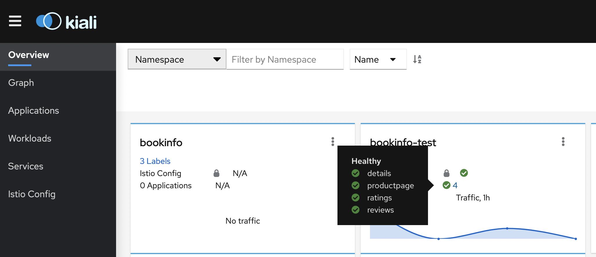
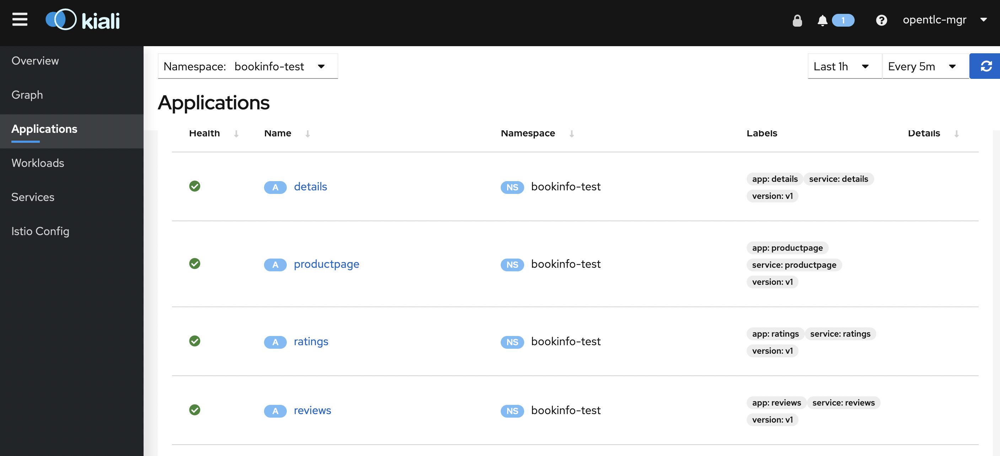
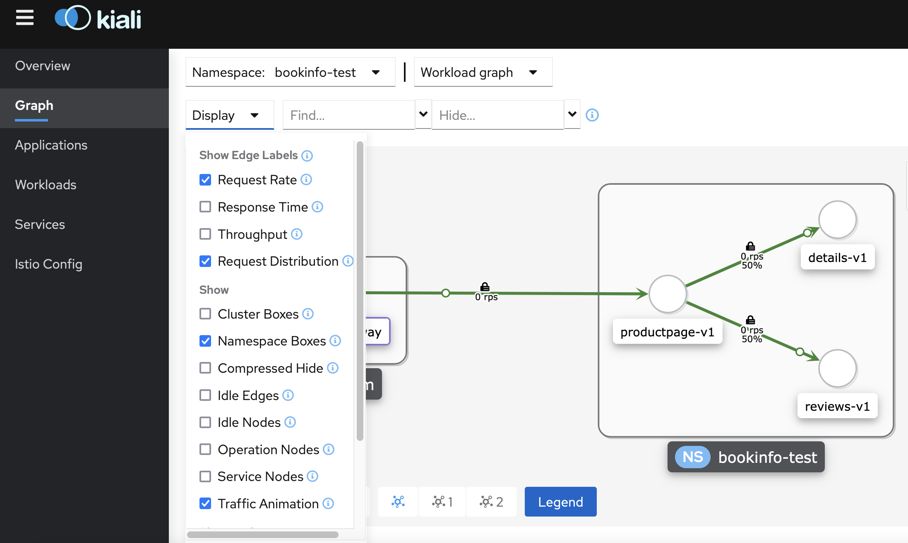
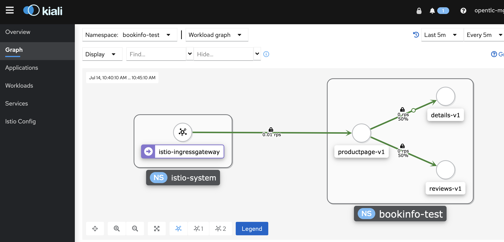
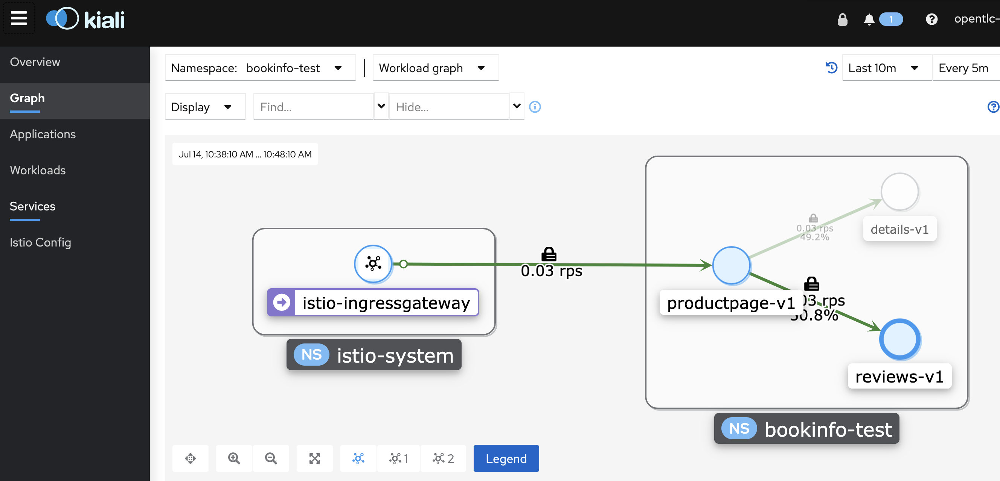
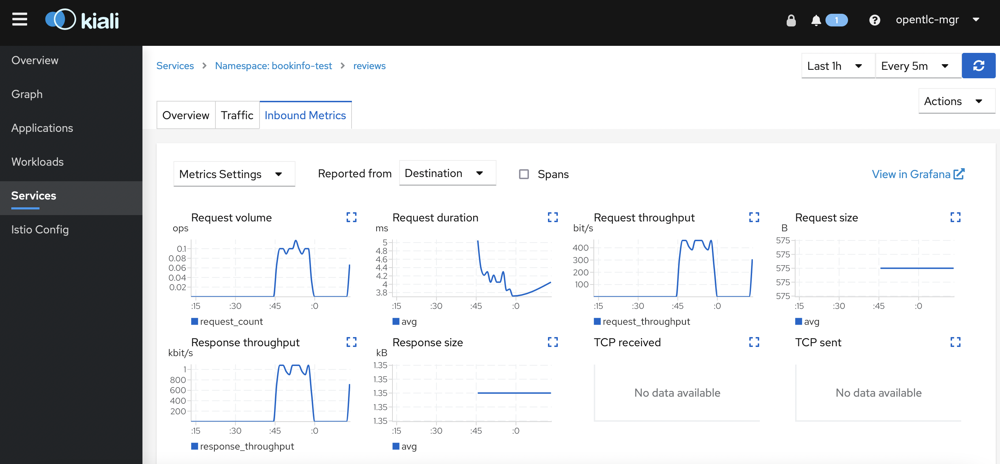
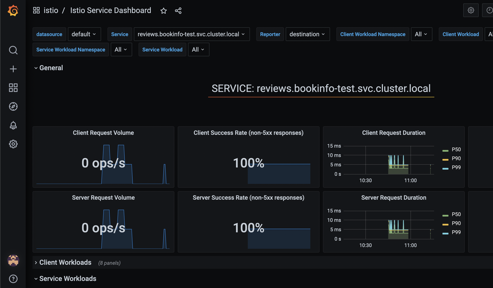

# Example GitOps-managed Service Mesh

Use this repository as a starting point to manage a Service Mesh on an OpenShift cluster.

## Provisioning the Service Mesh

1. Go to `Use this template > create a new repository` to generate a copy of this repository that you will use to manage your OpenShift cluster.

2. Configure the example ArgoCD `Application` by providing your new repository URL `spec.source.repoURL` in the following files:

    ```
    bootstrap/instance/application.yaml
    apps/application-service-mesh.yaml
    ```

3. Provision the ArgoCD operator:

    ```
    oc apply -k bootstrap/operator
    ```

4. Provision the ArgoCD `Application`:

    ```
    oc apply -k bootstrap/instance
    ```

## Observing ArgoCD Progress

The demo bootstrap initiates a default ArgoCD instance hosted in the `openshift-gitops` namespace. In this namespace a `Route` is deployed which provides a URL to the ArgoCD console.


## Onboarding an Application to the Service Mesh

The following instructions will describe how to manage applications deployed to the Service Mesh with this GitOps framework.

1. Request new namepaces

   New namespaces are added by including their definitions in `servicemesh/overlays/default/namespaces.yaml`. The namespaces `bookinfo-test` and `bookinfo-qa` are commented out there. Uncomment those lines 

2. Add the new namespaces to the ServiceMeshMemberRoll

   Uncomment the `test` and `qa` namespaces in `servicemesh/overlays/default/servicemeshmemberroll.yaml` to include them in the service mesh.

3. Add ArgoCD Applications for the bookinfo example

   You can define applications in the `apps` directory. Example application definitions are available for the sample bookinfo namespaces. Uncomment the lines in `apps/kustomization.yaml` to deploy those apps.

## Validating the bookinfo example

Use Kiali to visualize bookinfo traffic:

```
KIALI_URL=$(oc get route kiali -n istio-system -o jsonpath='{.spec.host}')
```
Or using openshift console: Networking->Routes->kiali

Open the URL on a browser and then click on the `bookinfo-test` app:



Make sure all services are healthy:


Call the `productinfo` page: export the ingress gateway URL into an env variable, use curl to invoke it:
```
BOOK_GW=$(oc get route istio-ingressgateway -n istio-system -o jsonpath="{.spec.host}{.spec.path}")
```
```
curl -v $BOOK_GW/productpage | grep '<title>Simple Bookstore App</title>'
```

Setup Kiali for traffic visualization by going to the left menu `Graph` then click on the drop down `Display` and select `Request Rate`, `Request Distribution`, `Namespace Boxes`, `Traffic Animation` options:


Use a simple script below to call the `productpage` every 10s:
```
while true; \
do curl -v $BOOK_GW/productpage | grep '<title>Simple Bookstore App</title>'; \
sleep 10;done
```
Enter Control-C to stop the script.

Switch to the graph and watch the animation, observe the statistics chosen in the graph selection:


Select the reviews service by clicking on the node and observe on the right the incoming traffic:


If you want to inspect traffic metrics even further, go to the left menu named `Services` and select the `reviews` service, then click on the `Inbound Metrics` tab:


In the same Kiali service view you have the ability to see more in detail metrics by jumping to Grafana, click on the blue link that reads `View in Grafana` and expect something like this:

